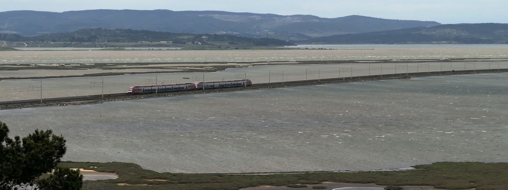
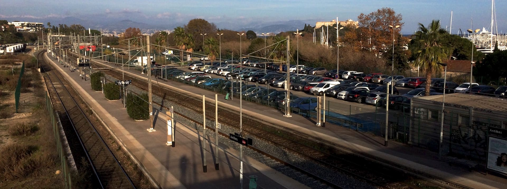
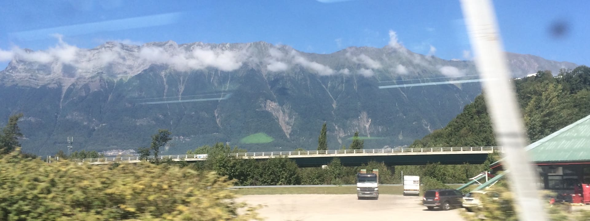

_[In English](./en)_

# NomadOpenEU

Une non-conférence à travers l'Europe pour grandir dans ses pratiques professionnelles en situation de nomadisme… et pour passer un bon moment entre coworking éphémère en train et rencontre de communautés locales !

## Quand, où, combien ?

**Proposition en construction, devis non finalisés et variables selon le nombre de participant·e·s, [feedbacks et suggestions](mailto:contact@nomadopen.eu) bienvenus !**

La première édition a lieu du jeudi 17 août 2017 au mercredi 23 août, en France, en Espagne et en Allemagne, pour environ 800 € (le prix des billets et du logement, nourriture non incluse).

Il est possible de participer à l'aventure d'un bout à l'autre, ou seulement pour certains des segments :

| Segment | Départ | Prix du train plein tarif | Durée du voyage | Nombre réel de participant·e·s |
|---------|--------|---------------------------|-----------------|--------------------------------|
| Paris | jeudi 17 août à 8h30 | 69 € | 3h | 4 |
| Bordeaux | vendredi 18 août à 15h | 36 € | 4h30 | 4 |
| San Sebastián | samedi 19 août à 7h30 | 55 € | 5h30 | 0 |
| Barcelona | lundi 21 août à 7h30 | 69 € | 5h | 0 |
| Lyon | mardi 22 août à 10h | 56 € | 6h | 0 |
| Francfort | mercredi 23 août à 14h | 49 € | 4h15 | 0 |

## Tu devrais venir si…

- Tu as envie de suivre tes deux pieds.
- Tu as envie de travailler dans un train.
- Tu as envie de rencontrer des gens.
- Tu es bienveillant·e.
- Tu es curieux·se.

Tu ne devrais pas venir si tu veux recevoir une formation pour devenir digital nomad. Il n'y aura pas de sachant·e·s, que des participant·e·s  :)

## Participer

Envie de monter dans le train ? Envie d'accueillir le groupe lors d'une étape (faire découvrir une ville, une communauté locale…) ? Une question ? Écris un mail à `contact{AT}nomadopen.eu`.

## De quoi on parlera

### Matériel et bonnes pratiques

- Connectivité : forfaits téléphoniques et appareils.
- Sacs : quoi prendre et dans quoi le transporter.
- Logement : échange, location, hôtel, auberge, amis…
- Cuisiner sans cuisine.
- Picoprojecteurs et écrans secondaires.
- Wifi proxy.
- MOSH (mobile shell).

### Grandes réflexions

- Le terme « nomade » est-il adapté ?

### Projets

- FriendlyPlaces : référencer collaborativement les espaces accueillants et compatibles avec nos pratiques.

### Whatever

Ce dont on aura envie de parler ! Propose un sujet, [maintenant](mailto:contact@nomadopen.eu) ou pendant le trajet !

## Qui était là

- [@matti_sg](https://twitter.com/matti_sg)
- [@krichtof](https://twitter.com/krichtof)
- [@pblayo](https://twitter.com/pblayo)
- [@cranedemorse](https://twitter.com/cranedemorse)
